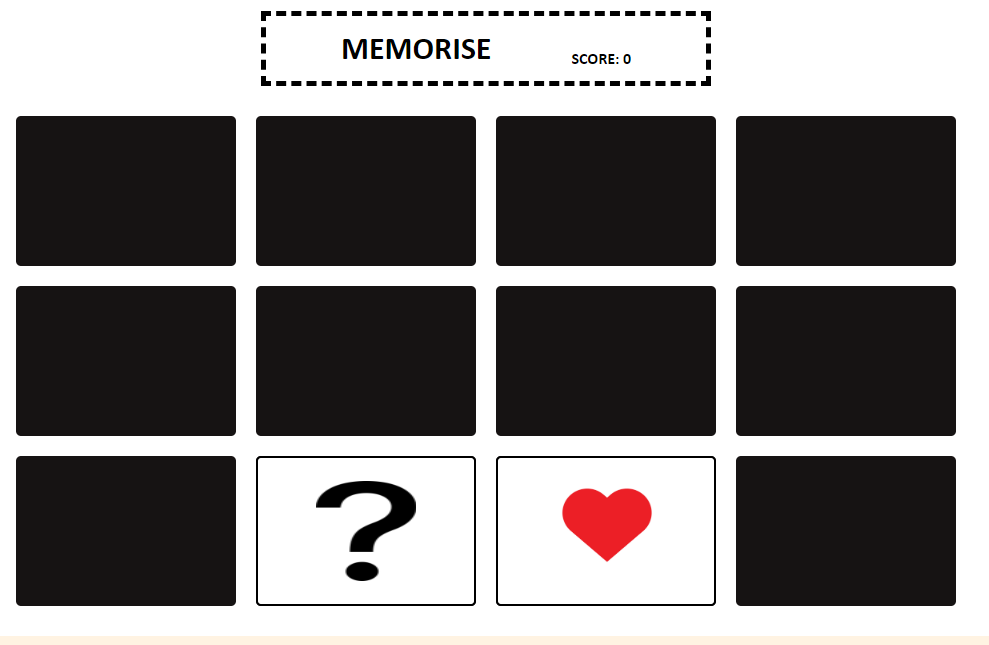

# Memorise

## Table of Contents

### UX Design

### Features
* Existing Features
* Features to be implemented
### Technologies Used
### Testing
### Deployment
### Credits
* Content
* Media
* Code
* Acknowledgements

## UX Design

### Project Goals
My goal for this project is to create a simple web-based puzzle game for users of all ages to enjoy and have fun with.

The user goals are:
* To be engaged with the game and its remembrance aspect.
* The desire to replay in order to better their score and better their memory skills.
* Enjoy the random aspect of the game, so that it isn't easy to guess the same cards every time they play.

The developer goals are:
* Interest in attracting people to their site to play their game.
* Interest in playing the game themselves.
* Keeping the site simple and not over-complicated or resource-heavy.

### User Stories
As a new user playing the game for the first time, I would want:
* Easy symbols to visualise.
* A description about the game and how to play it.
* An indicator of the score and which cards have already been matched.

As a returning user to the game, I would want:
* A randomiser to the cards so they aren't in the same pattern every new game.
* A potential option to make the grid bigger in order to increase difficulty.

### Design Choices

#### Font
* I have utilised the Gill Sans throughout the site because it is simple and readable to the user and does not stand out against the white background.

#### Background
* I have kept the background colourless as the site should be kept clean and as resource-light as possible. Loading massive images would not achieve this goal and would add distraction.
#### Styling
* The game-board is stored within a container, which changes its row and column size based on the dimensions of the screen the site is being viewed on.
* Below the game, I have added a welcome box with details about the game and how to play it.

### Wireframes
My initial wireframes kept a very simple look to the site and game which has been reflected in its final version.

* Desktop

* Mobile

## Features

### Existing Features
* Game Board
* Card Clicking/Flipping
* Score Counter
* Welcome Box

### Features to be implemented
* The ability to resize/choose a larger board which would be intriguing towards returning users who wish to test their memory further.
* A reset button that allows the user the restart the game at their will instead of the need to refresh the page.

## Technologies Used
* HTML 
* CSS 
* JavaScript

## Testing

### Testing User Stories
1. Description about the game and how to play it.
    * There is a clear description box underneath the game board which details how to play the game, how the board works and what all the symbols are.
2. An indicator of the score and which cards have already been matched.
    * To the right of the heading, there is a score counter which increments by 1 for every pair matched.
    * This amount resets to 0 every time the page is refreshed or a new game is started.
    * The cards that have been currently matched stay revealed on the board while the user continues to reveal the remaining cards.
3. A randomiser to the cards so they aren't in the same pattern every new game.
    * Every time the game begins or page is refreshed the cards are placed into random order, so that the pattern of card locations can't be memorised.
4. Easy symbols to visualise.
    * All of the symbols were sourced from simple vector sites with plain backgrounds which aren't distracting or abstract to the symbol itself.
    * They are large enough on the cards to be seen clearly on the page at normal site zoom levels.
### Manual Testing
* User expects score to increase after finding a pair.
    * 
    * 
    * Expected result as the 'score' value increments from 0 to 1 after revealing a pair.

* User expects the grid to adapt to mobile dimensions.
    * 
    * Tested using Chrome Developer Tools and the 'iPhone SE' layout.
    * The grid rightfully adapts to a mobile display by condensing the cards into more portrait shapes and utilising 3 columns instead of the usual 4.

* User expects the two selected cards to go back to blank if the pair is incorrect.
    * 
    * 
    * The cards return to blank as expected. This is due to the fact that their 'data-index' is not matching, so the function sets their state back to hidden.

### Site Checks

#### W3C CSS Validation

    

      

#### W3C HTML Validation

#### JSHint Validation

#### Google Dev Tools Lighthouse

    
### Bugs
* N/A

## Deployment
This project was developed using Visual Studio Code IDE with commits to git and pushed to GitHub using Source Control.

To deploy this page to GitHub Pages, these steps were taken:
1. Log into GitHub
2. Select repository **"jarough/memory"**
3. Click on settings at the top of repository page
4. Find the GitHub Pages section
5. Under **Source** select the branch 'Master Branch' instead of 'None'
6. The page is refreshed and the website is now live.

To clone this project:
1. Follow the [link](https://github.com/jarough/memory) to the repository
2. Click on the green **Code** button above the file list
3. Make sure **HTTPS** is highlighted and copy the link below it
4. Open Git Bash
5. Change the working directory to the location you want the cloned directory
6. Type 'git clone' followed by the URL you copied
7. Press **Enter** to create the clone.

## Credits

### Content & Media
* The images used for the cards were sourced from:
    * [Vecteezy](https://www.vecteezy.com/)
    * [Pixabay](https://pixabay.com/)
    * <a href="https://www.vecteezy.com/free-vector/playing-card-symbols-vector">Playing Card Symbols Vector Vectors by Vecteezy</a>
    * <a href="https://www.vecteezy.com/free-vector/exclamation-mark">Exclamation Mark Vectors by Vecteezy</a>
https://uxwing.com/question-mark-sign-icon/
Image by <a href="https://pixabay.com/users/clker-free-vector-images-3736/?utm_source=link-attribution&utm_medium=referral&utm_campaign=image&utm_content=48978">Clker-Free-Vector-Images</a> from <a href="https://pixabay.com//?utm_source=link-attribution&utm_medium=referral&utm_campaign=image&utm_content=48978">Pixabay</a>

### Code
* Code to help with box sizing altered from the [W3Schools](https://www.w3schools.com/css/css3_box-sizing.asp) CSS Box Sizing page.
* Worked out how to implement event timers using code from [W3Schools](https://www.w3schools.com/js/js_timing.asp) JavaScript Event Timing page.
* Code on how to randomise card images sourced from this [StackOverflow](https://stackoverflow.com/questions/74766348/how-to-make-img-within-div-to-shuffle-randomly) post.